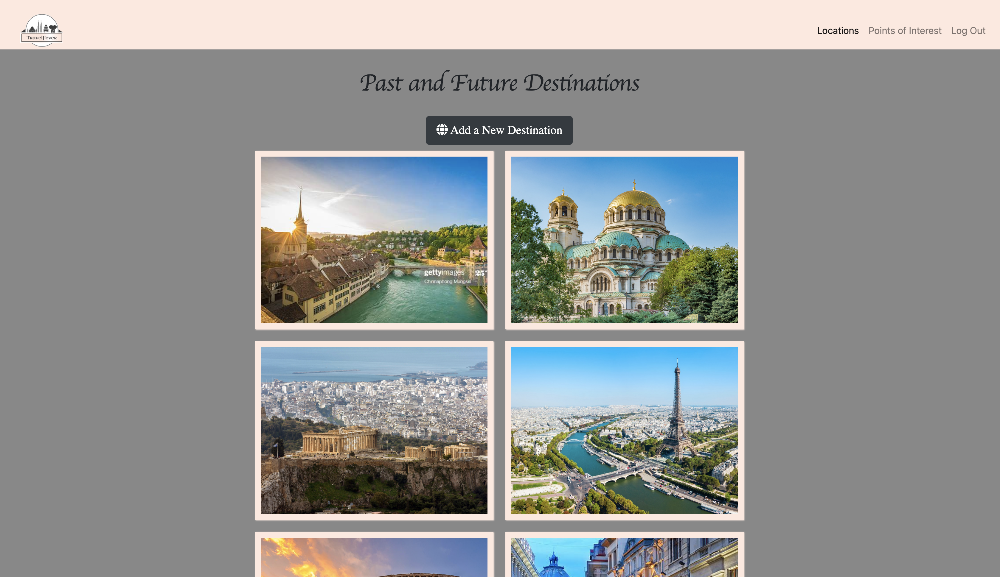
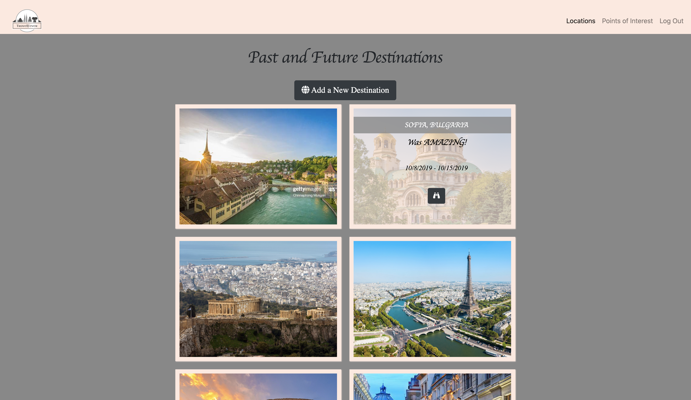
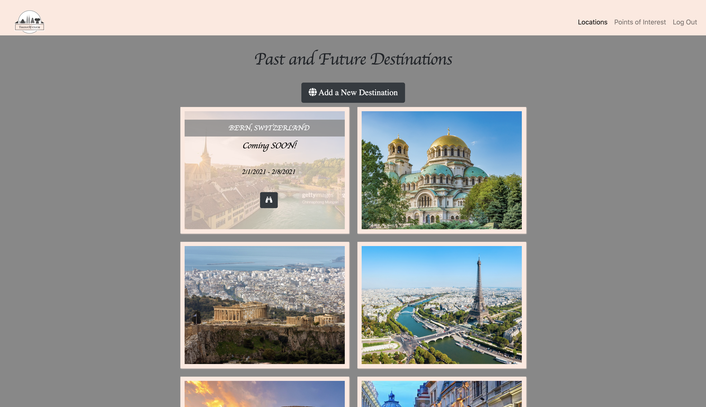

# Travel Fever

## Description
This was a bonus project I  tackled  during our React phase in order to further practice the skills  we learned with the React  library  - setting up a React project; completing CRUD actions with React and a Firebase database; authenticating using React, Firebase, and Google sign-in; and deploying a React project with Firebase. It is still  in progress. 

## Background
Project instructions can be found here: https://github.com/nss-nightclass-projects/exercise-vault/blob/master/REACT-travel_blog.md.

## Screenshots
#### Login Page Highlighting Travel Destinations

#### Destinations Page 

#### Destination Already Visited

#### Destination To Be Visited Soon

